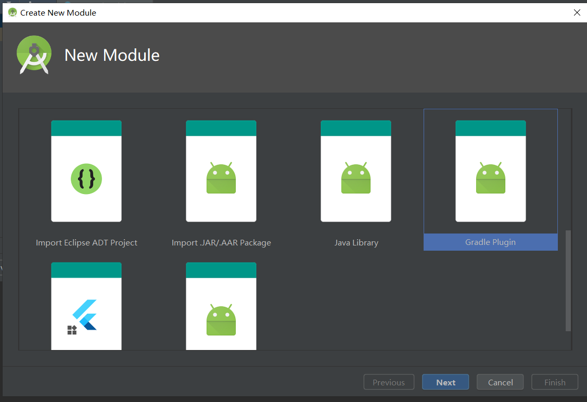
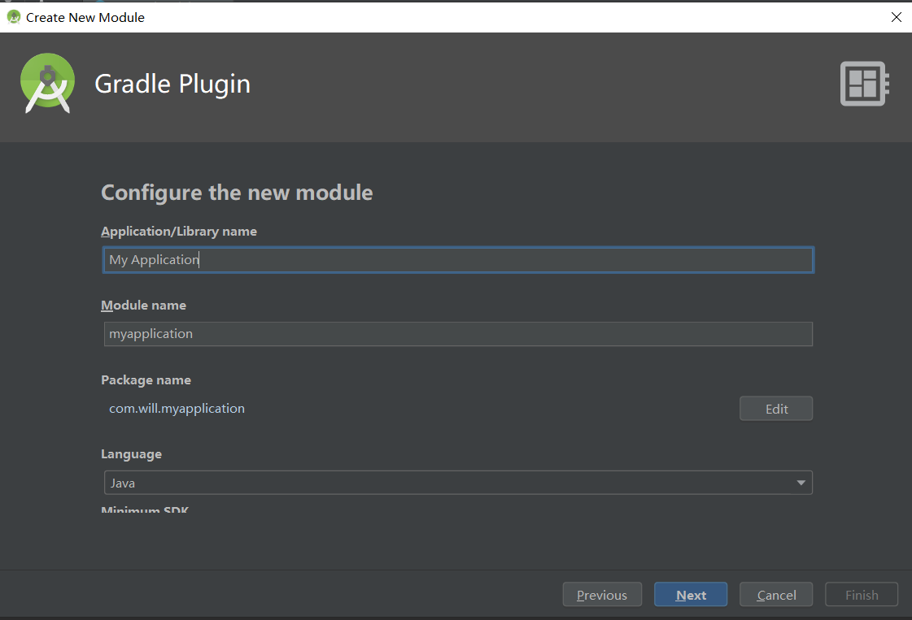
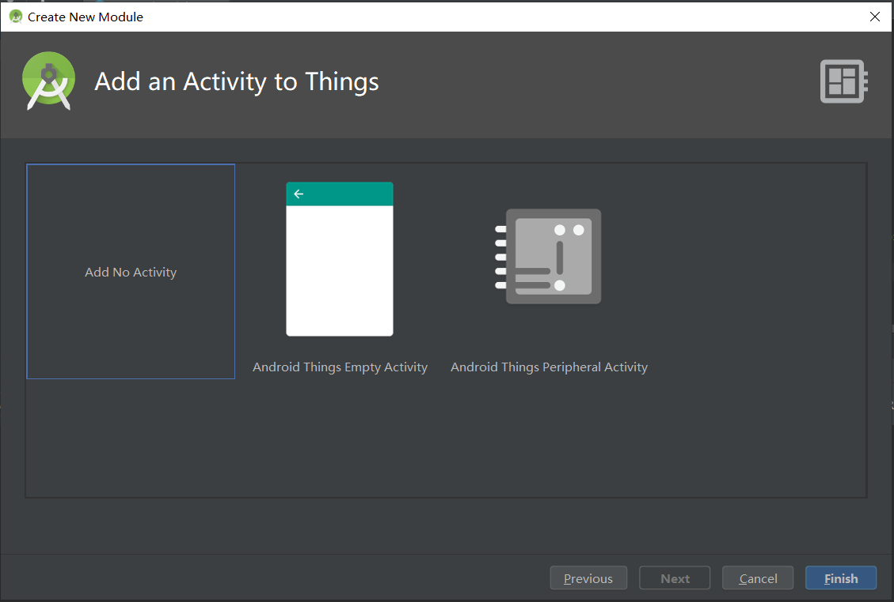

用于创建gradle 插件模板

使用方式：
    到AndroidStudio安装目录\Android Studio3.5\plugins\android\lib\templates\gradle-projects
    将GradlePlguin复制到该目录下，重启as即可
	
    创建一个module，选择gradle plugin，填完相对应的名字跟package后即可点击下一步，下一步点击add no activity即可完成创建
  
  
  

	
